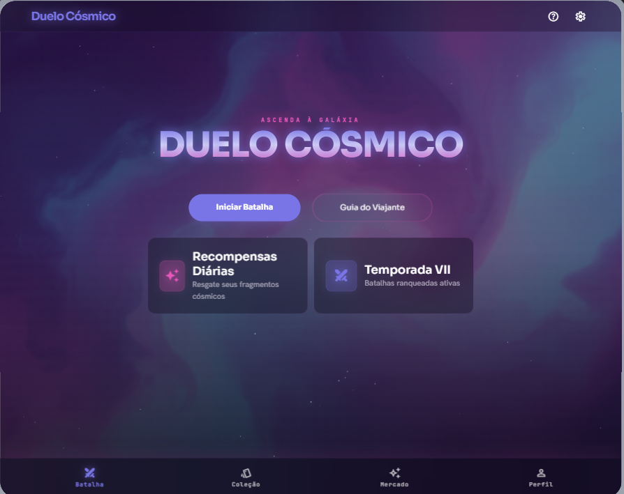
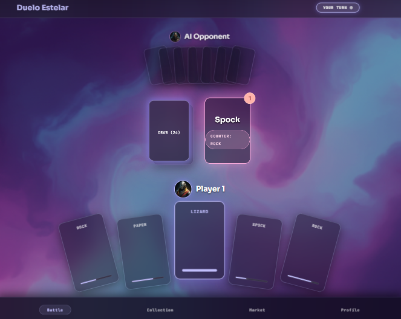
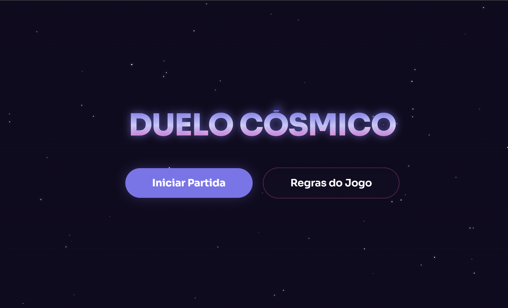
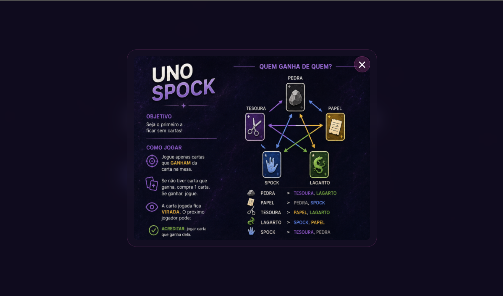
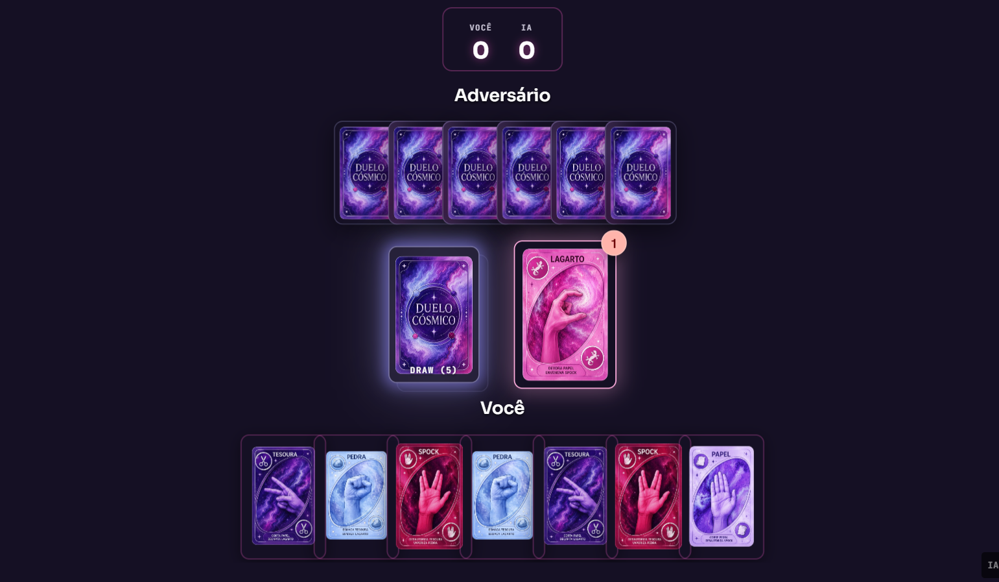
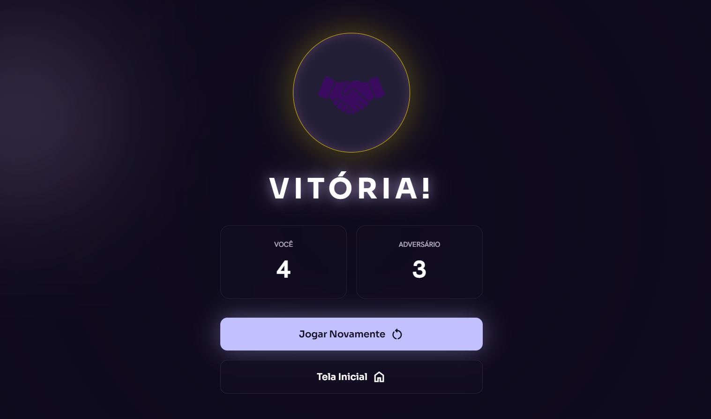

#  Jogo Pedra, Papel, Tesoura, Lagarto e Spock
Um jogo com linguagem em JavaScript e HTML de **Pedra, Papel, Tesoura, Lagarto e Spock**. Jogador 1 contra o próprio computador, com contagem de pontos. Na paleta de cores de roxo, rosa, azul, etc. Com sistema de regras do jogo **UNO**.

## Protótipo com Google Stitch
|||
|:-:|:-:|:-:|
|Tela Inicial|Tela do Jogo|Tela do Resultado

## Print do Jogo
||||
|:-:|:-:|:-:|:-:|
|Tela Inicial|Tela de Regras|Tela do Jogo|Tela de Resultado

## Tecnologias Utilizadas
- Google Stitch
- VsCode
- HTML
- CSS
- JavaScript
- Navegador de sua preferência

## Passo a passo para testar
- Clone o repositório
- Abra com VsCode
- Execute o index.html com o **Live Server**
